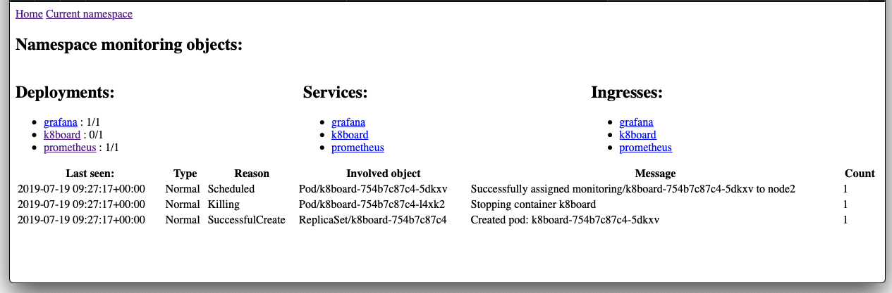
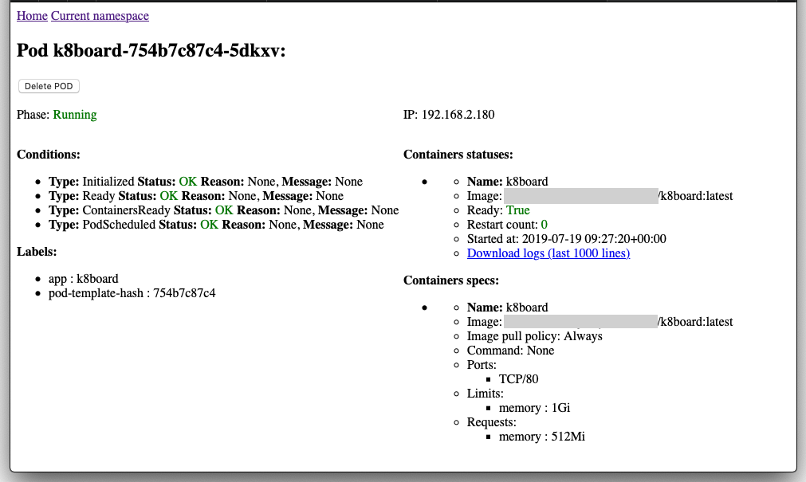

# k8board
Simplified interface to present state of your k8s cluster to developers (but not let them break stuff). 

# Motivation

You need to provide basic view of cluster status to all types of people in your organization who are not necessarily fluent in Kubernetes and don't want to be. Which is OK. There is also group of people who would want to introduce their changes to cluster. Just because. Which is not OK. This is solution for all those groups in your organization: 
 - backend developers
 - frontend developers
 - project managers
 - quality assurance engineers 
 - business analysts
 - upper management
 - ...  
 
You want to show them what is current label on their application. They don't want to use kubectl (or you don't want them to use it). For some reasons they do not have access (or are too lazy) to pipelines logs. 

So here is solution to very easily show them  what they want to see. 
 

# What it provides

1. View with list of namespaces. 
1. View of Namespace details with lists of: 
    - Deployments
    - Services
    - Ingresses
    - Logs
 
    of selected namespace. This view is main dashboard to see general state of namespace. 
 
    Example:
    
1. View of Deployment details with list of replicasets and its pods. 
1. View of Service details with list of related pods (via selector)
1. View of Ingress details with list of hosts, and paths inside, with links to related services (via Service name)
1. View of Pod details with its basic description and two actions: 
    - possibility to delete pod
    - possibility to download last 1000 lines of logs from pod
    
    Example:
    

# Configuration

If you want to use this you need to: 

1. Install this application with [k8board.yaml](k8board.yaml). In installs separate ServiceAccount, ClusterRole, CLusterRoleBinding and Deployment with k8board itself. 
1. After you install you'll see nothing in interface. To allow users to see their namespaces, you need to add annotation on desired namespaces like this: 

```yaml
apiVersion: v1
kind: Namespace
metadata:
  name: "your_namespace"
  annotations:
    k8board/list: "true"
```
